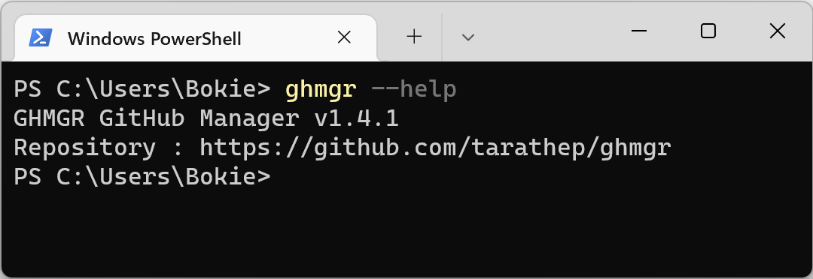

# GHMGR : GitHub Manager v.1.6.2 (latest)
CLI Application for Support GitHub Enterprise/Organize management GitHub APIs tools 


[](https://svgshare.com/i/Zhy.svg)
[](https://svgshare.com/i/ZjP.svg)
[](https://svgshare.com/i/ZhY.svg)




***Update***
- fix bug check already exist member in Github before invitation.
- add feature caching invite to team for support template csv file.
- improved performance & source code.

***Features***

- [Load](#load)
  - Init Cache (for the improve performance and query must init before use in the first time)
  - Load pending caching team on pending
  - Support GitHub Action for implement workflows cronjob task (github.com/corp-ais/cdc-github-manager)

- [List](#list)
  - List Team in Organization
  - List Membership of Teams
  - List member in team
  - List member in team status pending
  - List member in team role
  - List member in team Email
  - List member in team Exclude another team
  - List member in CSV file
  - List member of Organization
  - List member of Organization Show Email , Teams
  - List Dormant users of the organization from CSV file
- [Invite](#invite)
  - Invite member single command
  - Cancel Organization Invitation
- [Add](#add)
  - Add or Update Membership of Team with Username
  - Add or Update Membership of Team with Email
- [Remove](#remove)
  - Remove Team Membership For User
  - Remove Membership of Organization
  - Remove dormant users of the organization from CSV file
  - Remove Membership of Organization without membership of team and verify email
- [Import](#import)
  - Import & Invite or Update Team Member from CSV Template
- [Export](#export)
  - Export or Update Team Member to CSV Template
- [Rewrite](#rewrite)
  - Rewrite format before import or update team Member from CSV Template file
- [Check](#check)
  - Check Team Membership for User
  - Check Membership for User in ORG
  - Check member for invite to team
  - Check and verify csv template format
- [Get](#get)
  - Get GitHub Username from Email
  - Get Primary Email from GitHub Username


## Installation

Download bin file and set env path (depending on OS)


## Login

### Login GitHub Personal Token

on Windows with 

Command Prompt

```cmd
set GHMGR_TOKEN=php_xxxxxxxxxxxxxxxxxx
set GHMGR_OWNER=xxxxx
```
PowerShell
```ps
$env:GHMGR_TOKEN="php_xxxxxxxxxxxxxxxxxx"
$env:GHMGR_OWNER="corp-ais"
```


on Unix or MacOS

```bash
export GHMGR_TOKEN=php_xxxxxxxxxxxxxxxxxx
export GHMGR_OWNER=xxxxx
```

or login with app (don't on support CMD,PS)

```bash
ghmgr login --token php_xxxxxxxxxxxxxxxxxx --owner xxxxx
```

or on pipeline you can use option --token recommand for secret

example

```bash
ghmgr list member -t teamname --token php_xxxxxxxxxxxxxxxxxx --owner corp-xxx
```


## Load

### Init Cache

for the improve performance and query must init before use in the first time

```bash
ghmgr load cache 
```


## List

### List Team in Organization

Lists all teams in an organization that are visible to the authenticated user.
https://docs.github.com/en/rest/reference/teams#list-teams

```bash
 ghmgr list team
```

### List Membership of Teams

**option**

```-u,--username``` username

```bash
ghmgr list team --username [username]
```

### List member in team

**option**

```-t,--team``` team name (team in GitHub)

```bash
ghmgr list member --team [teamname]
```

### List member in team status pending

**option**

```-t,--team``` team name (team in GitHub)

```-p,--pending``` invited status pending


```bash
ghmgr list member --team [teamname] --pending
```

### List member in team role

**option**

```-t,--team``` team name (team in GitHub)

```-r,--role``` role team

```bash
ghmgr list member --team [teamname] --role
```


### List member in team Email

**option**

```-t,--team``` team name (team in GitHub)

```-m show,--email show``` email show

```bash
ghmgr list member --team [teamname] --email show
```

### List member in team Exclude another team

**option**

```-t,--team``` team name (team in GitHub)

```-e ,--exclude``` exclude team member will be invisible

```bash
ghmgr list member --team [teamname] --exclude [teamname]
```


### List member in CSV file

for the files workspace in : ```report/input/teamname.csv```

**option**

```-f,--file``` Filename.CSV


```bash
ghmgr list member --file teamname.csv
```

### List member of Organization

**option**

```-o,--org``` Org


```bash
ghmgr list member --org
```

### List member of Organization Show Email , Teams

**option**

```-o,--org``` Org

```-m show,--email show``` Email

```-t show,--team show``` Teams


```bash
ghmgr list member --org --email show --team show
```

### List Dormant users of the organization from CSV file

**option**

for the file workspace in : ```report/input/dormant-users-report-xxxxxx.csv```

```-f,--file``` filename.csv


```bash
ghmgr list member dormant --file dormant-users-report-xxxxxx.csv
```


## Invite

### Invite member single command

**option**

```-t,--team``` team name (team in GitHub)

```-e,--email``` email

```bash
ghmgr invite member --team [teamname] --email name@domain.com
```


### Cancel Organization Invitation

**option**

```-c,--cancel``` Cancel

```bash
ghmgr invite member --cancel --email name@domain.com
```


## Add

### Add or Update Membership of Team with Username

**option**

```-t,--team``` team name (team in GitHub)

```-u,--username``` GitHub username

```-r,--role``` Role of Team (maintainer, member)

```bash
ghmgr add member --team [teamname] --email [name@domain.com] -r maintainer
```

### Add or Update Membership of Team with Email

must load cache and add verify email account before use this cmd.

**option**

```-t,--team``` team name (team in GitHub)

```-m,--email``` email (verify)

```-r,--role``` Role of Team (maintainer, member)

```bash
ghmgr add member --team [teamname] --email [name@domain.com] -r maintainer
```


## Remove

### Remove Team Membership For User

To remove a membership between a user and a team (without Organization)


**option**

```-t,--team``` teamname (slug team name lowercase)

```-u,--username``` GitHub username

```bash
ghmgr remove member --team [teamname] --username [username]
```

### Remove Membership of Team Without Email

To remove a membership between a user and a team (without Organization) focus public Email isn't appear.

**option**

```-t,--team``` teamname (slug team name lowercase)
```-m null,--email null``` email only null

```bash
ghmgr remove member -t [teamename] -m null
```


### Remove Membership of Organization 

Removing a user from this list will remove them from all teams and they will no longer have any access to the organization's repositories


**option**

```-o,--org``` organization

```-u,--username``` GitHub username

```bash
ghmgr remove member --org --username [username]
```

### Remove Organization Members Without Membership of Teams

**option**

```-o,--org``` organization

```-t null,--team null``` null only

```bash
ghmgr remove member -o -t null
```


### Remove dormant users of the organization from CSV file

for the file workspace in : ```report/input/dormant-users-report-xxxxxx.csv```

**option**

```-f,--file``` filename.csv

```-b,--backup``` the backup file for review

```bash
ghmgr remove member dormant --file dormant-users-report-xxxx.csv --backup
```

the backup file output into report/output/dormant-users-report-xxxxxx.csv-review-xxxx.csv


## Import

### Import & Invite or Update Team Member from CSV Template

must load cache and add verify email account before use this cmd.

**Attention** 

- the template can update but support who configured email address at profile (email don’t empty)

- the Project Name must lowercase only we use slug GitHub Team name (seem team url link https://github.com/orgs/owner-org/teams/team-name) e.g.  “Team Name” => “team-name“ 

- focus at GitHub column when
    - Y is active then do
        - GitHub Username is empty will be invite member using email
        - GitHub Username already but outside ORG or already in another team will be update into member team (calculate 1 license)

    - N is active when
        - GitHub Username already and then will be removed from the team but still in ORG

    - Empty is not active


the file input template in : ```reports/input/team-name.csv```

**option**

```-f,--file``` file name.csv (team in GitHub)

```bash
ghmgr import template --file team-name.csv
```


## Export

### Export or Update Team Member to CSV Template

must load cache and add verify email account before use this cmd.

**Attention** 

- the template can update but support who configured email address at profile (email don’t empty)

- the Project Name must lowercase only we use slug GitHub Team name (seem team url link https://github.com/orgs/owner-org/teams/team-name) e.g.  “Team Name” => “team-name“ 

- focus at GitHub column when
    - Y is active then do
        - GitHub Username is empty will be invite member using email
        - GitHub Username already but outside ORG or already in another team will be update into member team (calculate 1 license)

    - N is active when
        - GitHub Username already and then will be removed from the team but still in ORG

    - Empty is not active


the file output template in : ```reports/output/team-name.csvxxx.csv```

**option**

```-t,--team``` team name (team in GitHub)

```bash
ghmgr export template --team team-name
```

## Rewrite

### Rewrite format before import or update team Member from CSV Template file

**option**

```-t,--team``` team name (team in GitHub)

```bash
ghmgr rewrite template -t [teamname]
```

## Check

### Check Team Membership for User 

**option**

```-t,--team``` team name (team in GitHub)

```-u,--username``` github username

```bash
ghmgr check member --team [team-name] --username [username]
```

### Check Membership for User in ORG

**option**

```-u,--username``` github username

```bash
ghmgr check member --username [username]
```

### Check and Verify CSV format template

**option**

```-f,--file``` filename.csv

```bash
ghmgr check report -f [filename].csv
```


## Get

### Get GitHub Username from Email

**option**

```-m,--email``` GitHub Email (Primary Email) 


```bash
ghmgr get member username --email name@domain.com
```

### Get Primary Email from GitHub Username

**option**

```-u,--username``` github username

```bash
ghmgr get member email --username [username]
```


